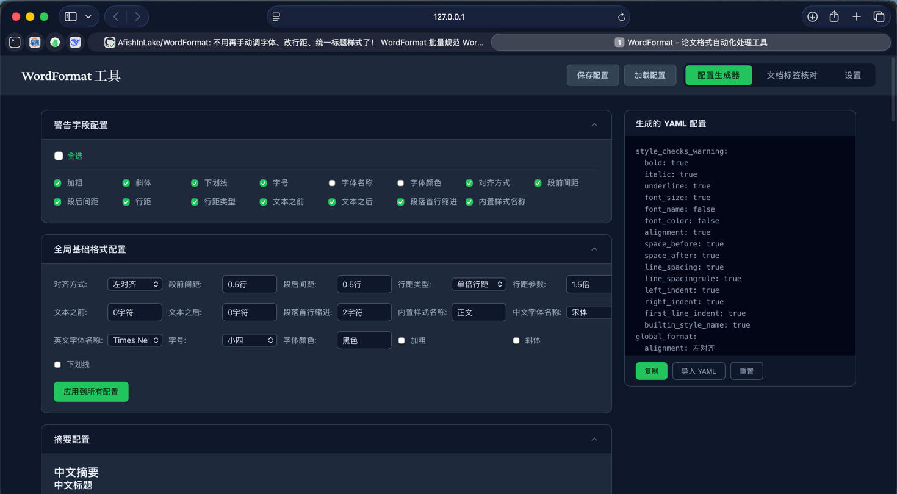
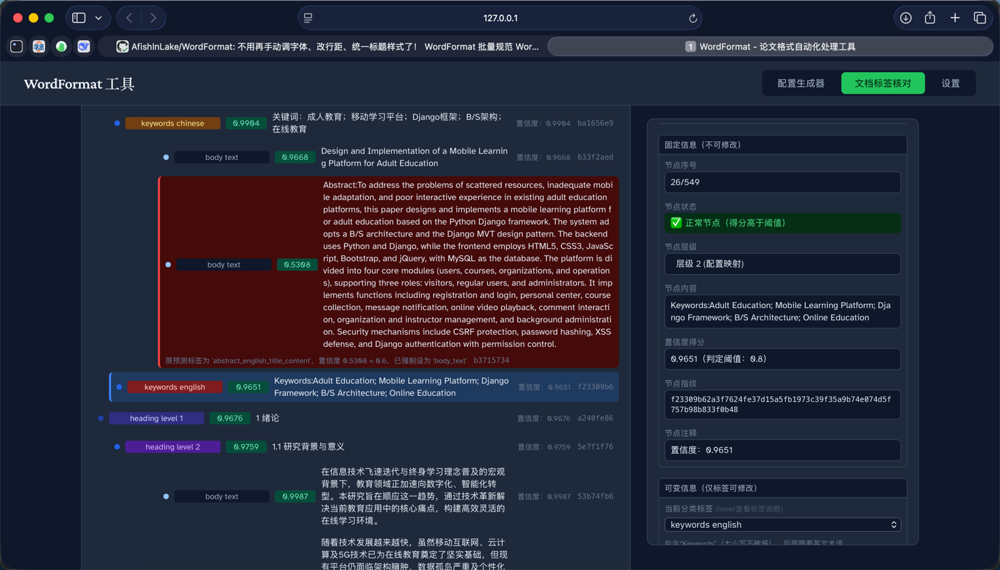

# WordFormat

> Automated Academic Paper Formatting Tool


## Project Introduction

**WordFormat** is a Python-based tool for automated format checking and correction of Word documents, specifically designed for compliance review of academic papers (undergraduate/master's/doctoral theses, journal articles, etc.). The tool intelligently parses Word document structures, identifies different paragraph types such as headings, abstracts, main text, and references, and automatically validates document formatting against custom specifications. It supports adding comments at violation locations or directly fixing formatting issues, significantly improving the efficiency of thesis formatting reviews.

## Features

### Core Capabilities
- **Intelligent Document Structure Parsing**: Automatically identifies paragraph types such as headings, abstracts, main text, keywords, and references using an ONNX model, and generates a structured JSON configuration file
- **Fine-grained Format Validation**: Supports comprehensive checks for paragraph formatting (alignment, line spacing, indentation, spacing) and character formatting (font, font size, color, bold/italic/underline)
- **Multi-level Heading Management**: Accurately identifies level-1/2/3 headings and supports custom heading format specification validation
- **Multi-language Support**: Distinguishes between Chinese and English font/formatting rules, perfectly supporting format checks for mixed-language documents
- **Flexible Interaction Workflow**: Supports a step-by-step process of "generate structure file → manually adjust → execute validation", balancing automation and flexibility

### Practical Features
- **Markdown to Word**: Supports direct conversion of Markdown files into formatted `.docx` documents, preserving heading hierarchy and automatically applying format specifications from the configuration
- **Automatic Comment Generation**: Automatically adds Word comments at violation locations, indicating the issue type and correction suggestions
- **Document Structure Visualization**: Displays paragraph classification and hierarchical relationships in a tree structure via the `wordf tree` command, with support for category filtering and confidence score display
- **One-click Format Correction**: Automatically fixes common formatting issues (e.g., heading font size, body text line spacing) based on specifications
- **Automatic Heading Numbering**: Automatically removes manual numbering and applies Word's built-in auto-numbering, with customizable numbering templates (e.g., "Chapter X", "1.1.1"), suffixes (tab/space/none), and indentation settings
- **Web GUI**: Built-in Vue frontend interface; launch the graphical operation panel with one click via `wordf startapi` to move away from the command line
- **Customizable Configuration**: Flexibly define format specifications via YAML configuration files to adapt to the requirements of different universities/journals
- **Cross-platform Compatibility**: Supports Windows/macOS/Linux systems, utilizing `python-docx` for cross-platform Word document processing

## Video Tutorial
[Click to watch on Bilibili](https://www.bilibili.com/video/BV1aiDjB8Edg/?spm_id_from=333.1007.top_right_bar_window_history.content.click&vd_source=490c514f59611dc0b600c1da58948e14)

## Quick Start

### Environment Requirements
- Python 3.10+ (version 3.11 or higher recommended)
- Dependency management tools: `uv` (recommended) or `pip`

### Installation Steps

**Method 1: Install via pipx (Highly Recommended)**

`pipx` automatically isolates the environment and registers commands, ready to use immediately without PATH issues.

```bash
# 安装 pipx（如果还没有）
brew install pipx        # macOS
pip install pipx         # 其他平台

# 安装 WordFormat
pipx install wordformat

pipx install wordformat
```

After installation, directly use the `wordf` or `wordformat` command.

**Method 2: Install via pip**

```bash
pip install wordformat
```

> If you encounter "command 'wordf' not found" after installation, it means the Python scripts directory is not in your system PATH.
> Please use `python3 -m wordformat` instead, or switch to `pipx` installation.

**Method 3: Install from Source (For Developers)**

1. **Clone the repository**
   ```bash
   git clone https://github.com/AfishInLake/WordFormat.git
   cd WordFormat
   ```

2. **Install dependencies**
   ```bash
   make install
   # 或使用 pip
   pip install -e .
   ```

3. **Download the model**
   ```bash
   python scripts/download_model.py
   ```

## Core Usage

### Command Line Usage (Recommended)

WordFormat provides three core execution modes:

```bash
# 0. 生成配置模板
wordf config -o 配置.yaml

# 1. 生成文档结构 JSON
wordf gj -d 论文.docx -c 配置.yaml

# 2. 查看文档结构树（检查分类是否正确）
wordf tree -f 结构文件.json

# 3. 执行格式校验（添加批注，不修改原文）
wordf cf -d 论文.docx -c 配置.yaml -f 结构文件.json

# 4. 执行自动格式化（一键修正格式）
wordf af -d 论文.docx -c 配置.yaml -f 结构文件.json

# 5. 启动 Web 可视化界面
wordf startapi
# 然后在浏览器打开 http://127.0.0.1:8000

# 6. Markdown 转 Word（从 Markdown 直接生成格式化后的 .docx）
wordf md -d 论文.md -c 配置.yaml
```
### `startapi` Command Line Preview (Recommended)

```bash
# 安装
pip install wordformat
# 启动 Web 可视化界面
wordf startapi
# 访问 http://127.0.0.1:8000

# 若提示无法找到 wordf 命令，请改用 pipx 安装
# 或直接使用：
python3 -m wordformat startapi
```

- It is recommended to use a `.bat` file for quick startup
Create a `start.txt` file on your desktop, paste the following command into it, change the extension to `.bat` (full filename `start.bat`), and double-click to run
```bash
python -m wordformat startapi
```
#### Configuration Interface


#### Formatting Operation Interface


For more detailed usage instructions, please refer to the [Usage Guide](https://github.com/AfishInLake/WordFormat/blob/master/docs/usage.md)

## Preset Configurations

The project includes built-in formatting presets for multiple universities, located in the `presets/` directory. You can use them directly or modify them as needed.

## Detailed Documentation

For more detailed documentation, please check the `docs/` directory:

- [Installation Guide](https://github.com/AfishInLake/WordFormat/blob/master/docs/installation.md) - Environment requirements and installation steps
- [Usage Guide](https://github.com/AfishInLake/WordFormat/blob/master/docs/usage.md) - Detailed usage instructions for CLI, Python programming, and API calls
- [Configuration File Reference](https://github.com/AfishInLake/WordFormat/blob/master/docs/configuration.md) - Format specification settings and custom configuration methods
- [Markdown to Word](https://github.com/AfishInLake/WordFormat/blob/master/docs/md-to-docx.md) - Introduction and usage instructions for Markdown → Docx conversion
- [FAQ](https://github.com/AfishInLake/WordFormat/blob/master/docs/faq.md) - Frequently asked questions and solutions
- [Contributing Guide](https://github.com/AfishInLake/WordFormat/blob/master/docs/contributing.md) - How to contribute code and documentation to the project
- [Technical Architecture](https://github.com/AfishInLake/WordFormat/blob/master/docs/architecture.md) - The project's technical architecture and implementation principles

## License

[Apache License 2.0](LICENSE) - Allows free use, modification, and distribution, provided the original copyright notice is retained.

## Contact

- Feedback Channel: GitHub Issues (highly recommended for easy issue tracking and discussion)
- Email: 1593699665@qq.com

## Project Contributors

To be updated. Welcome to all developers to submit PRs and contribute code to help improve this tool together!
