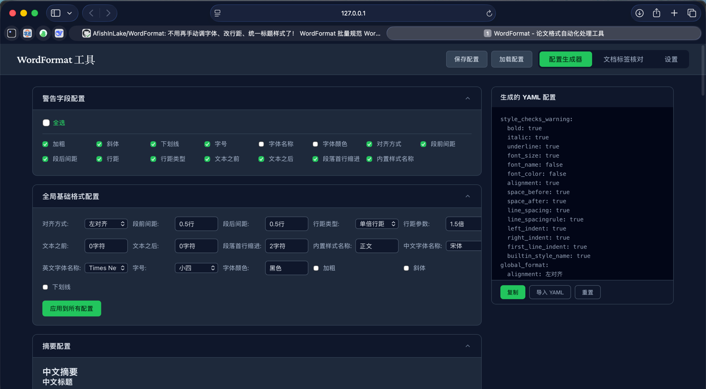
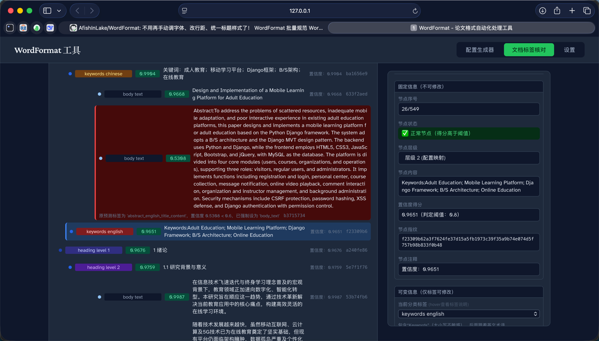

# 使用指南（已更新至 极简命令版）

本文档详细说明 WordFormat 的使用方法，包括命令行交互、Python 编程调用和 API 调用三种方式。

## 命令行使用（推荐 · 极简版）

WordFormat 现已支持**超短命令**，输入更快捷、不易出错。
支持 **`wordformat` / `wordf`** 双命令启动。

---

## 极简命令速查（最常用）
```bash
# 生成文档结构 JSON（自动保存，无需指定json路径）
wordf gj -d 论文.docx -c 配置.yaml

# 查看文档结构树（检查分类是否正确）
wordf tree -f 生成的文件.json

# 检查格式错误（添加批注，不修改原文）
wordf cf -d 论文.docx -c 配置.yaml -f 生成的文件.json

# 自动格式化论文（一键修正格式）
wordf af -d 论文.docx -c 配置.yaml -f 生成的文件.json

# 启动API服务（提供Web接口）
wordf startapi
```

---

## 详细使用说明

### 命令说明
- `wordf` 或 `wordformat`：工具主命令
- `gj`：generate-json → 生成文档结构 JSON
- `tree`：查看文档结构树
- `cf`：check-format → 检查格式
- `af`：apply-format → 自动格式化
- `startapi`：启动API服务

### 通用参数
- `-d`：**必填**，Word 文档路径
- `-c`：YAML 格式配置文件路径（推荐提供，不传则使用内置默认配置）
- `-f`：JSON 文件路径（**仅 cf/af/tree 需要**）
- `-o`：输出目录（可选，默认 `output/`）
- `-H`：API服务地址（可选，默认 `127.0.0.1`，**仅 startapi**）
- `-p`：API服务端口（可选，默认 `8000`，**仅 startapi**）

---

## 1. 生成文档结构 JSON
**自动生成 JSON 文件，保存到 `-o` 目录**
**文件名 = 文档名 + 10位时间戳**，永不重复

```bash
# 最简用法（带配置文件）
wordf gj -d your_document.docx -c example/undergrad_thesis.yaml

# 不带配置文件（使用内置默认配置）
wordf gj -d your_document.docx

# 自定义输出目录
wordf gj -d your_document.docx -c example/undergrad_thesis.yaml -o output/
```

### JSON 字段说明

生成的 JSON 是一个段落列表，每个段落包含以下字段：

| 字段 | 类型 | 说明 |
|------|------|------|
| `category` | `str` | 段落类别，如 `heading_level_1`、`body_text`、`abstract_chinese_title` 等 |
| `paragraph` | `str` | 段落文本内容（不含自动编号前缀） |
| `score` | `float` | AI 分类置信度（0~1） |
| `comment` | `str` | 分类说明/日志 |
| `replace` | `str`（可选） | 替换文本，设置后格式化时会将段落文字替换为此值 |

### 编辑 JSON 实现文本替换

在 `wordf gj` 生成的 JSON 中，给任意段落添加 `replace` 字段，`wordf cf` 或 `wordf af` 执行时会将对应段落的文字替换为该值：

```json
{
    "category": "abstract_chinese_content",
    "paragraph": "原始摘要文字...",
    "score": 0.95,
    "comment": "置信度：0.9500",
    "replace": "修改后的摘要内容..."
}
```

替换规则：
- 单 run 段落：直接覆盖整个 run 的文本
- 多 run 段落：按各 run 的原始长度比例分配替换文本，**保留 run 边界**（维持混排格式，如中英文不同字体）
- check 模式和 apply 模式均会执行替换
- 替换发生在格式修正之前，因此替换后的文字会参与后续格式校验

也可以手动调整 `category` 字段来修正 AI 分类错误，调整 `paragraph` 字段供参考（不会自动写回 Word，需配合 `replace` 使用）。

---

## 2. 查看文档结构树
**可视化展示文档的段落分类和层级结构**，用于快速检查 AI 识别结果是否正确。

```bash
# 查看完整结构（含各类别统计）
wordf tree -f output/论文_1744123456.json

# 仅查看标题结构
wordf tree -f output/论文_1744123456.json --filter heading_level_1,heading_level_2

# 显示节点序号
wordf tree -f output/论文_1744123456.json --index

# 显示分类置信度
wordf tree -f output/论文_1744123456.json --confidence
```

**tree 专属参数：**

| 参数 | 作用 | 示例 |
|------|------|------|
| `--filter` | 仅显示指定类别（逗号分隔） | `--filter heading_level_1,body_text` |
| `--index` | 显示节点序号 | `--index` |
| `--confidence` | 显示分类置信度 | `--confidence` |

**输出示例：**
```
📄 文档结构树 (414 个段落)
============================================================
  body_text                       302
  heading_level_3                  47
  heading_level_2                  23
  heading_level_1                   6
============================================================
└── 【heading_level_1】 1 绪论
    ├── 【heading_level_2】 1.1 研究背景与意义
    └── 【heading_level_2】 1.2 国内外发展现状
└── 【heading_level_1】 2 系统相关理论与技术
    ├── 【heading_level_2】 2.1 B/S架构理论
    └── 【heading_level_2】 2.2 Django Web框架技术
```

---

## 3. 执行格式校验
仅检查错误、添加 Word 批注，**不修改原文**

```bash
# 基础用法
wordf cf -d your_document.docx -c example/undergrad_thesis.yaml -f output/论文_1744123456.json

# 自定义输出目录
wordf cf -d your_document.docx -c example/undergrad_thesis.yaml -f output/论文_1744123456.json -o check_result/
```

---

## 4. 执行自动格式化
一键自动修正论文格式，生成新的规范文档

```bash
# 基础用法
wordf af -d your_document.docx -c example/undergrad_thesis.yaml -f output/论文_1744123456.json

# 自定义输出目录
wordf af -d your_document.docx -c example/undergrad_thesis.yaml -f output/论文_1744123456.json -o final_output/
```

> **标题自动编号**：如果配置文件中启用了 `numbering.enabled: true`，格式化时会自动清除标题的手动编号并应用 Word 自动编号。编号样式（字体/字号/加粗）会自动跟随标题配置。此功能仅在 `wordf af` 模式下生效。

---

## 5. 启动 Web 可视化界面（startapi）

`wordf startapi` 会启动一个完整的 Web 服务，提供以下能力：

| 能力 | 说明 |
|------|------|
| **可视化操作界面** | 内置 Vue SPA 前端，浏览器中直接上传文档、一键执行校验/格式化 |
| **RESTful API** | 提供 HTTP 接口，方便其他程序/脚本调用 |
| **Swagger 文档** | 自动生成的交互式 API 文档（`/docs`），可在浏览器中直接调试接口 |
| **文件下载服务** | 校验/格式化后的结果文件可直接下载 |

### 启动方式

```bash
pip install wordformat

# 默认启动（127.0.0.1:8000，仅本机可访问）
wordf startapi

# 监听所有网络接口（局域网内其他设备也可访问）
wordf startapi -H 0.0.0.0 -p 8080
```

### 访问地址

| 地址 | 说明 |
|------|------|
| `http://127.0.0.1:8000` | 前端可视化操作界面 |
| `http://127.0.0.1:8000/docs` | Swagger API 交互式文档 |
| `http://127.0.0.1:8000/redoc` | ReDoc API 文档 |

### 前端界面功能

启动后在浏览器打开 `http://127.0.0.1:8000`，可以看到完整的图形化操作面板：

1. **上传文档**：选择 `.docx` 文件
2. **上传配置**（可选）：选择 `.yaml` 格式配置文件，不传则使用内置默认配置
3. **一键生成 JSON**：调用 `/generate-json` 接口，解析文档结构
4. **格式校验**：调用 `/check-format` 接口，生成带批注的标注版文档
5. **格式修正**：调用 `/apply-format` 接口，生成修正后的新版文档
6. **下载结果**：校验/修正完成后直接下载 `.docx` 结果文件

前端使用 `fetch` 直接请求后端 API，前后端一体化部署，无需额外配置代理。

### API 端点一览

| 方法 | 路径 | 说明 |
|------|------|------|
| `POST` | `/generate-json` | 上传 docx + 可选 yaml，返回文档结构 JSON |
| `POST` | `/check-format` | 上传 docx + json_data + 可选 yaml，返回标注版文档下载链接 |
| `POST` | `/apply-format` | 上传 docx + json_data + 可选 yaml，返回修改版文档下载链接 |
| `GET` | `/download/{filename}` | 下载处理后的结果文档 |
| `GET` | `/docs` | Swagger UI 接口文档 |
| `GET` | `/redoc` | ReDoc 接口文档 |

#### 配置界面


#### 格式化操作界面

### 通过 API 编程调用示例

```python
import requests

# 1. 生成文档结构 JSON
with open("论文.docx", "rb") as f:
    resp = requests.post(
        "http://127.0.0.1:8000/generate-json",
        files={"docx_file": f}
    )
json_data = resp.json()["data"]["json_data"]

# 2. 执行格式校验
with open("论文.docx", "rb") as f:
    resp = requests.post(
        "http://127.0.0.1:8000/check-format",
        files={"docx_file": f},
        data={"json_data": str(json_data)}
    )
download_url = resp.json()["data"]["download_url"]
print(f"校验结果: http://127.0.0.1:8000{download_url}")
```

---

## 完整测试示例
```bash
# 1. 生成 JSON（自动命名）
wordf gj -d "tmp/毕业设计说明书.docx" -c "example/undergrad_thesis.yaml"

# 2. 查看文档结构（检查分类）
wordf tree -f "output/毕业设计说明书_1744123456.json"

# 3. 格式检查
wordf cf -d "tmp/毕业设计说明书.docx" -c "example/undergrad_thesis.yaml" -f "output/毕业设计说明书_1744123456.json"

# 4. 自动格式化
wordf af -d "tmp/毕业设计说明书.docx" -c "example/undergrad_thesis.yaml" -f "output/毕业设计说明书_1744123456.json"
```

---

## 参数对照表（极简版）

| 命令 | 全称 | 作用 | 必填参数 |
|------|------|------|----------|
| `wordf gj` | generate-json | 生成文档结构 JSON | `-d`（`-c` 推荐） |
| `wordf tree` | tree | 查看文档结构树 | `-f` |
| `wordf cf` | check-format | 检查格式并添加批注 | `-d`,`-c`,`-f` |
| `wordf af` | apply-format | 自动格式化论文 | `-d`,`-c`,`-f` |
| `wordf startapi` | start-api | 启动Web可视化界面 | 无 |

| 参数 | 作用 | 必填 |
|------|------|------|
| `-d` | Word 文档路径 | 是（gj/cf/af） |
| `-c` | YAML 配置路径 | 推荐（gj）/ 是（cf/af），不传使用默认配置 |
| `-f` | JSON 文件路径 | 是（cf/af/tree） |
| `-o` | 输出目录 | 否（默认 output） |
| `-H` | API服务地址 | 否（默认 127.0.0.1） |
| `-p` | API服务端口 | 否（默认 8000） |

---

## Python 编程调用（保持不变）

### 1. 生成文档结构 JSON
```python
from wordformat.classify.tag import set_tag_main

# configpath 可选，不传使用默认配置
set_tag_main(
    docx_path="your_document.docx",
    configpath="example/undergrad_thesis.yaml"
)
```

### 2. 执行格式检查
```python
from wordformat.pipeline.orchestrate import auto_format_thesis_document

# configpath 可选，不传使用默认配置
auto_format_thesis_document(
    jsonpath="output/论文_1744123456.json",
    docxpath="your_document.docx",
    configpath="example/undergrad_thesis.yaml",
    savepath="check_result/",
    check=True
)
```

### 3. 执行自动格式化
```python
from wordformat.pipeline.orchestrate import auto_format_thesis_document

# configpath 可选，不传使用默认配置
auto_format_thesis_document(
    jsonpath="output/论文_1744123456.json",
    docxpath="your_document.docx",
    configpath="example/undergrad_thesis.yaml",
    savepath="final_output/",
    check=False
)
```

---

## API 调用 & 开发模式

> 详细的 API 使用说明（端点、前端界面、编程调用示例）已整合到上方 [5. 启动 Web 可视化界面](#5-启动-web-可视化界面startapi) 章节。

### 开发者本地启动（不安装 PyPI 包）

```bash
# 使用 make
make server

# 或直接使用 uvicorn
pip install -e "."
python start_api.py
```

启动后访问：http://127.0.0.1:8000/docs

---
